# Phase 3: MCP (Model Context Protocol) Integration

## Overview

Model Context Protocol (MCP) enables AI assistants to securely connect to external data sources and tools. This phase integrates essential MCP servers into our AI development stack to enhance AI agent capabilities.

## MCP Architecture

### High-Level Architecture

```mermaid
graph TB
    subgraph "AI Consumers"
        Claude["🤖 Claude Desktop"]
        VSCode["📝 VS Code/Codium"]
        Cursor["🖱️ Cursor"]
        FlowiseAI["🌊 FlowiseAI"]
        LiteLLM["⚡ LiteLLM Proxy"]
        OpenWebUI["🌐 Open WebUI"]
    end
    
    subgraph "MCP Transport Layer"
        Transport["📡 MCP Transport\n(stdio, SSE, WebSocket)"]
    end
    
    subgraph "MCP Servers"
        subgraph "Core Development"
            Git["📂 Git Server"]
            FS["📁 Filesystem"]
            Fetch["🌐 Fetch Server"]
        end
        
        subgraph "Platform Integration"
            GitHub["🐙 GitHub"]
            GitLab["🦊 GitLab"]
            SonarQube["🔍 SonarQube"]
        end
        
        subgraph "Data & Storage"
            PostgreSQL["🐘 PostgreSQL"]
            Memory["🧠 Memory"]
            Time["⏰ Time"]
        end
    end
    
    subgraph "External Services"
        GHRepo["GitHub.com"]
        GLRepo["GitLab.com"]
        SQInstance["SonarQube Instance"]
        Database["PostgreSQL DB"]
    end
    
    Claude --> Transport
    VSCode --> Transport
    Cursor --> Transport
    FlowiseAI --> Transport
    LiteLLM --> Transport
    OpenWebUI --> Transport
    
    Transport --> Git
    Transport --> FS
    Transport --> Fetch
    Transport --> GitHub
    Transport --> GitLab
    Transport --> SonarQube
    Transport --> PostgreSQL
    Transport --> Memory
    Transport --> Time
    
    GitHub <--> GHRepo
    GitLab <--> GLRepo
    SonarQube <--> SQInstance
    PostgreSQL <--> Database
```



### MCP Protocol Flow


## Selected MCP Servers

### 1. Core Development Tools
- **Git MCP Server**: Repository management, version control operations
- **Filesystem MCP Server**: Secure file operations with access controls
- **Fetch MCP Server**: Web content retrieval and conversion

### 2. Database & Storage
- **PostgreSQL MCP Server**: Database schema inspection and queries
- **Memory MCP Server**: Persistent knowledge graph storage

### 3. Development Platform Integration
- **GitHub MCP Server**: Official GitHub server for repos, issues, PRs, actions, code security
- **GitLab MCP Server**: GitLab integration for repository management
- **SonarQube MCP Server**: Code quality analysis and security scanning

### 4. Utility Services
- **Time MCP Server**: Time and timezone utilities
- **Everything MCP Server**: Reference server for testing and demonstrations

## Implementation Plan

### Approach 1: IDE-Side Integration (Recommended for Development)

**Status: ✅ Complete**

Direct IDE integration provides the most flexible and resource-efficient approach for development workflows:

1. **Configuration Files Created**:
   - Workspace-specific: `.vscode/mcp.json`
   - Global template: `configs/ide-mcp/vscode-mcp.json`
   - Support for VS Code, Codium, Cursor, and other MCP-compatible editors

2. **Supported MCP Servers**:
   - **GitHub MCP Server** (`ghcr.io/github/github-mcp-server`)
   - **GitLab MCP Server** (`zereight/gitlab-mcp`)
   - **SonarQube MCP Server** (`sonarsource/sonarqube-mcp-server`)

3. **Key Benefits**:
   - On-demand server execution (only when needed)
   - Direct workspace mounting for seamless file access
   - Secure token management through IDE input prompts
   - No additional infrastructure requirements

### Approach 2: Docker Compose Stack (For Production/Team Use)

**Status: 🔄 Planned**

Full containerized deployment for team environments and production use:

#### Docker Compose Architecture

```mermaid
graph TB
    subgraph "AI Dev Local Stack"
        subgraph "Server Services"
            Langfuse["📊 Langfuse\nPort 3000"]
            FlowiseAI["🌊 FlowiseAI\nPort 3001"]
            OpenWebUI["🌐 Open WebUI\nPort 8080"]
            LiteLLM["⚡ LiteLLM Proxy\nPort 4000"]
        end
        
        subgraph "MCP Gateway"
            Gateway["🚪 MCP Gateway\nPort 9000"]
        end
        
        subgraph "MCP Servers"
            Git["📂 Git\nPort 9001"]
            FS["📁 Filesystem\nPort 9002"]
            Fetch["🌐 Fetch\nPort 9003"]
            Memory["🧠 Memory\nPort 9004"]
            Time["⏰ Time\nPort 9005"]
            PostgreSQL["🐘 PostgreSQL\nPort 9006"]
            Everything["🛠️ Everything\nPort 9007"]
            GitHub["🐙 GitHub\nPort 9008"]
            GitLab["🦊 GitLab\nPort 9009"]
            SonarQube["🔍 SonarQube\nPort 9010"]
        end
    end
    
    subgraph "Network"
        MCPNetwork["ai-dev-mcp\n172.20.0.0/16"]
    end
    
    FlowiseAI <--> Gateway
    LiteLLM <--> Gateway
    OpenWebUI <--> Gateway
    Langfuse <--> LiteLLM
    
    Gateway --> Git
    Gateway --> FS
    Gateway --> Fetch
    Gateway --> Memory
    Gateway --> Time
    Gateway --> PostgreSQL
    Gateway --> Everything
    Gateway --> GitHub
    Gateway --> GitLab
    Gateway --> SonarQube
    
    Git -.-> MCPNetwork
    FS -.-> MCPNetwork
    Fetch -.-> MCPNetwork
    Memory -.-> MCPNetwork
    Time -.-> MCPNetwork
    PostgreSQL -.-> MCPNetwork
    Everything -.-> MCPNetwork
    GitHub -.-> MCPNetwork
    GitLab -.-> MCPNetwork
    SonarQube -.-> MCPNetwork
```



#### Step 1: MCP Infrastructure Setup
Create MCP server orchestration using Docker Compose to manage multiple MCP servers with proper isolation and networking.

#### Step 2: Core Server Integration
Start with essential servers that directly support development workflows:
1. Git server for repository operations
2. Filesystem server for code file access
3. PostgreSQL server for database interactions

#### Step 3: Enhanced Capabilities
Add specialized servers for enhanced AI functionality:
1. Memory server for persistent context
2. Fetch server for web research
3. Time server for scheduling and logging

#### Step 4: Client Integration
Configure MCP clients to connect AI services (Claude, LiteLLM, FlowiseAI) to the MCP servers through proper transport protocols.

### Approach 3: Hybrid Setup

**Status: 🔄 Planned**

Combine both approaches for maximum flexibility:
- IDE-side integration for development and debugging
- Docker Compose stack for shared services and production features
- Seamless switching between approaches based on use case

## FlowiseAI MCP Integration

### FlowiseAI as MCP Consumer

FlowiseAI can consume MCP servers to enhance its workflow capabilities:

```mermaid
graph LR
    subgraph "FlowiseAI Workflows"
        Workflow1["🎯 Code Review\nWorkflow"]
        Workflow2["🔍 Quality Analysis\nWorkflow"]
        Workflow3["📊 Project Insights\nWorkflow"]
    end
    
    subgraph "MCP Tools"
        GitHub["🐙 GitHub Tools"]
        SonarQube["🔍 SonarQube Tools"]
        Memory["🧠 Memory Tools"]
        FS["📁 File Tools"]
    end
    
    Workflow1 --> GitHub
    Workflow1 --> FS
    Workflow2 --> SonarQube
    Workflow2 --> GitHub
    Workflow3 --> Memory
    Workflow3 --> GitHub
    Workflow3 --> SonarQube
```



### Integration Benefits

1. **Dynamic Workflows**: FlowiseAI can dynamically access development tools
2. **Real-time Data**: Direct access to repositories, issues, and quality metrics
3. **Contextual Processing**: Persistent memory for workflow context
4. **Automated Analysis**: Combine multiple MCP servers for comprehensive analysis

### Example FlowiseAI Workflows

#### Code Review Workflow
```yaml
workflow:
  name: "Automated Code Review"
  steps:
    1. fetch_pull_request:  # GitHub MCP
        tool: "get_pull_request"
        params: {pr_number: "{{input.pr_number}}"}
    
    2. analyze_changes:     # Filesystem MCP
        tool: "read_file"
        params: {path: "{{step1.changed_files}}"}
    
    3. quality_check:       # SonarQube MCP
        tool: "get_issues"
        params: {project_key: "{{input.project}}"}
    
    4. store_context:       # Memory MCP
        tool: "add_observations"
        params: {content: "{{steps.1-3.results}}"}
```

## Benefits for AI Development

### For AI Agents
- **Secure Tool Access**: Controlled access to development tools
- **Persistent Memory**: Knowledge graphs for context retention
- **Multi-modal Capabilities**: Text, file, database, and web interactions
- **Workflow Orchestration**: FlowiseAI can orchestrate complex multi-step processes

### For Developers
- **Enhanced AI Assistance**: AI can directly interact with your development environment
- **Workflow Integration**: Seamless integration with existing development tools
- **Extensible Architecture**: Easy to add new capabilities through additional MCP servers
- **Visual Workflow Design**: FlowiseAI provides drag-and-drop workflow creation

### For Projects
- **Code Understanding**: AI can analyze repositories, understand project structure
- **Database Interactions**: Direct database queries and schema exploration
- **Research Capabilities**: Web content fetching for documentation and research
- **Automated Workflows**: FlowiseAI can automate complex development processes

## Security Considerations

- **Sandboxed Execution**: Each MCP server runs in isolated containers
- **Access Controls**: Filesystem server with configurable access permissions
- **Network Isolation**: Proper Docker networking to limit server communication
- **Audit Logging**: All MCP interactions logged for security monitoring

## Getting Started

### Quick Start with IDE Integration

1. **Follow the IDE Setup Guide**: See [`docs/IDE_MCP_SETUP.md`](IDE_MCP_SETUP.md) for detailed instructions
2. **Configure Your IDE**: Use the provided configuration files in `configs/ide-mcp/` or `.vscode/`
3. **Obtain Access Tokens**: GitHub, GitLab, and SonarQube personal access tokens
4. **Test Integration**: Ask your AI assistant to interact with your repositories

### Current Implementation Status

- ✅ **IDE MCP Configuration**: Complete with VS Code/Codium support
- ✅ **Documentation**: Comprehensive setup and usage guides
- ✅ **Security Framework**: Token-based authentication and secure configurations
- 🔄 **Docker Compose Stack**: Planned for Phase 3.2
- 🔄 **Additional MCP Servers**: Git, Filesystem, PostgreSQL, Memory servers planned

## Next Steps

### Phase 3.1: IDE Integration (Complete)
1. ✅ **IDE MCP Configuration**: Created workspace and global configurations
2. ✅ **Documentation**: Comprehensive setup guide with troubleshooting
3. ✅ **Security Guidelines**: Token management and access control documentation

### Phase 3.2: Docker Compose Stack (Planned)
1. **Infrastructure Setup**: Create MCP Docker Compose configuration
2. **Server Deployment**: Deploy core MCP servers with proper configuration
3. **Client Integration**: Configure AI services to use containerized MCP servers
4. **FlowiseAI Integration**: Configure FlowiseAI workflows to consume MCP servers
5. **Testing & Validation**: Verify MCP functionality across the stack

### Phase 3.3: Advanced Features (Future)
1. **Additional MCP Servers**: Git, Filesystem, PostgreSQL, Memory, Fetch, Time servers
2. **Hybrid Configuration**: Seamless switching between IDE and containerized approaches
3. **Team Collaboration**: Multi-user MCP server configurations
4. **Advanced Security**: RBAC, audit logging, and access controls
5. **FlowiseAI Templates**: Pre-built workflow templates for common development tasks
6. **Cross-Server Orchestration**: Complex workflows spanning multiple MCP servers

This MCP integration transforms your AI development environment into a truly intelligent, context-aware system where AI agents can actively participate in development workflows with secure access to all necessary tools and data sources.
