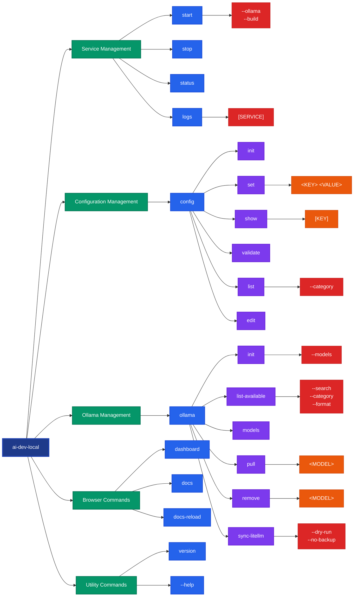

# CLI Reference

AI Dev Local CLI provides various commands to manage and operate AI services effectively.

## Command Schema Overview

The AI Dev Local CLI follows a hierarchical command structure with clear categories and consistent patterns:



### Command Categories

| Category | Purpose | Key Commands |
|----------|---------|-------------|
| **Service Management** | Control Docker services | `start`, `stop`, `status`, `logs` |
| **Configuration** | Manage .env settings | `config set`, `config show`, `config validate` |
| **Ollama Management** | Local AI model operations | `ollama pull`, `ollama sync-litellm` |
| **Browser Integration** | Quick access to UIs | `dashboard`, `docs`, `docs-reload` |
| **Utility** | Version and help | `version`, `--help` |

### Common Patterns

- **Hierarchical Structure**: Commands are grouped logically (`config`, `ollama`)
- **Consistent Options**: Similar flags across related commands (`--dry-run`, `--category`)
- **Progressive Disclosure**: Basic commands work with defaults, advanced options available
- **Context-Sensitive Help**: `--help` available at every level
- **Safe Operations**: Destructive actions require confirmation or offer `--dry-run`

### Quick Reference

```bash
# Essential workflow
ai-dev-local config init                    # Setup
ai-dev-local config set OPENAI_API_KEY ... # Configure
ai-dev-local start                          # Launch
ai-dev-local dashboard                      # Access

# Local AI models
ai-dev-local start --ollama                 # Start with Ollama
ai-dev-local ollama list-available --category code  # Browse
ai-dev-local ollama pull codellama:7b       # Install
ai-dev-local ollama sync-litellm            # Integrate

# Configuration management
ai-dev-local config validate                # Check setup
ai-dev-local config list --category api-keys # View keys
ai-dev-local config edit                    # Manual edit
```

## Main Commands

### `ai-dev-local --help`

Get help for any command or subcommand.

```bash
ai-dev-local --help
ai-dev-local config --help
ai-dev-local ollama --help
```

## Service Management

### `ai-dev-local start`

Start all AI Dev Local services.

```bash
# Start core services
ai-dev-local start

# Start with Ollama for local models
ai-dev-local start --ollama

# Build images before starting
ai-dev-local start --build

# Combine options
ai-dev-local start --ollama --build
```

**Options:**
- `--ollama`: Include Ollama service for local LLM models
- `--build`: Build Docker images before starting services

**Example Output:**
```
🚀 Starting AI Dev Local services...
📋 Version: v0.2.1-3-g1a2b3c4
📅 Build Date: 2025-01-27T15:30:42Z
✅ Services started successfully!

📋 Service URLs:
  • Dashboard: http://localhost:3002
  • Langfuse: http://localhost:3000
  • FlowiseAI: http://localhost:3001
  • Open WebUI: http://localhost:8081
  • LiteLLM Proxy: http://localhost:4000
  • Documentation: http://localhost:8000
  • Ollama: http://localhost:11434
```

### `ai-dev-local stop`

Stop all running AI services cleanly.

```bash
ai-dev-local stop
```

**Example Output:**
```
🛑 Stopping AI Dev Local services...
✅ Services stopped successfully!
```

### `ai-dev-local status`

Show the current status of all services.

```bash
ai-dev-local status
```

**Example Output:**
```
📊 Service Status:
      Name                    Command               State           Ports
-------------------------------------------------------------------------
ai-dev-local_dashboard_1    /docker-entrypoint.sh   Up          0.0.0.0:3002->80/tcp
ai-dev-local_flowise_1      docker-entrypoint.sh     Up          0.0.0.0:3001->3000/tcp
ai-dev-local_langfuse_1     docker-entrypoint.sh     Up          0.0.0.0:3000->3000/tcp
ai-dev-local_litellm_1      python -m litellm        Up          0.0.0.0:4000->4000/tcp
ai-dev-local_mkdocs_1       mkdocs serve             Up          0.0.0.0:8000->8000/tcp
ai-dev-local_ollama_1       /bin/ollama serve        Up          0.0.0.0:11434->11434/tcp
ai-dev-local_open-webui_1   bash start.sh            Up          0.0.0.0:8081->8080/tcp
ai-dev-local_postgres_1     docker-entrypoint.sh     Up          0.0.0.0:5432->5432/tcp
ai-dev-local_redis_1        docker-entrypoint.sh     Up          0.0.0.0:6379->6379/tcp
```

### `ai-dev-local logs [SERVICE]`

Show logs for services. Optionally specify a specific service.

```bash
# Show logs for all services
ai-dev-local logs

# Show logs for specific service
ai-dev-local logs litellm
ai-dev-local logs langfuse
ai-dev-local logs flowise
```

## Browser Commands

### `ai-dev-local docs`

Open documentation in your default browser.

```bash
ai-dev-local docs
```

### `ai-dev-local docs-reload`

Reload/update MkDocs documentation service.

```bash
ai-dev-local docs-reload
```

**Features:**
- Checks if MkDocs service is running
- Stops the current MkDocs service
- Rebuilds the MkDocs Docker image to include documentation changes
- Starts the service with the updated image
- Shows updated documentation URL
- Optionally opens documentation in browser

**Use Cases:**
- After editing documentation files (markdown, mkdocs.yml, etc.)
- When documentation changes aren't reflected in the browser
- To rebuild documentation with updated content
- After adding new documentation pages or assets

**Prerequisites:** MkDocs service must be running (`ai-dev-local start`)

**Note:** This command rebuilds the Docker image, which may take a few moments depending on the size of your documentation.

### `ai-dev-local dashboard`

Open the main dashboard in your default browser.

```bash
ai-dev-local dashboard
```

## Version Information

### `ai-dev-local version`

Display current version information.

```bash
ai-dev-local version
```

**Example Output:**
```
🏷️  Current Version: v0.2.1-3-g1a2b3c4 (development)
```

Shows version from git tags with fallback hierarchy:
1. Exact git tag match
2. Latest git tag with commit info (development)
3. Package version from `__init__.py` (no git tags found)

## Configuration Management

### `ai-dev-local config`

Manage configuration and .env file settings.

#### `ai-dev-local config init`

Initialize .env file from .env.example template.

```bash
ai-dev-local config init
```

**Example Output:**
```
✅ Created .env from .env.example

📝 Next steps:
  1. Edit .env file with your API keys and settings
  2. Use 'ai-dev-local config set' to update specific values
  3. Use 'ai-dev-local config show' to view current settings
```

#### `ai-dev-local config set <KEY> <VALUE>`

Set a configuration value in the .env file.

```bash
# Set API keys
ai-dev-local config set OPENAI_API_KEY *********************
ai-dev-local config set ANTHROPIC_API_KEY ********************

# Set ports
ai-dev-local config set LANGFUSE_PORT 3030
ai-dev-local config set DASHBOARD_PORT 3003

# Set service options
ai-dev-local config set DEBUG true
ai-dev-local config set OLLAMA_GPU true
```

**Example Output:**
```
✅ Set LANGFUSE_PORT=3030
```

**Features:**
- Automatically creates .env file if it doesn't exist
- Preserves inline comments when updating values
- Intelligently places new keys in appropriate sections
- Supports all configuration categories

#### `ai-dev-local config show [KEY]`

Show configuration values from .env file.

```bash
# Show all configuration
ai-dev-local config show

# Show specific key (sensitive values are masked)
ai-dev-local config show OPENAI_API_KEY
ai-dev-local config show LANGFUSE_PORT
```

**Features:**
- Automatically masks sensitive values (API keys, secrets, passwords, tokens)
- Shows all non-comment configuration lines
- Displays specific key values when requested

#### `ai-dev-local config validate`

Validate .env file configuration.

```bash
ai-dev-local config validate
```

**Validation includes:**
- **Required Settings:** OPENAI_API_KEY, WEBUI_SECRET_KEY, LITELLM_MASTER_KEY
- **Optional Settings:** ANTHROPIC_API_KEY, GEMINI_API_KEY, COHERE_API_KEY, LANGFUSE_*
- **Status Report:** Shows which settings are configured or missing
- **Recommendations:** Provides next steps for missing required settings

#### `ai-dev-local config list [--category CATEGORY]`

List configuration variables by category.

```bash
# Show all categories
ai-dev-local config list

# Show specific category
ai-dev-local config list --category api-keys
ai-dev-local config list --category ports
ai-dev-local config list --category services
ai-dev-local config list --category mcp
```

**Categories:**
- **api-keys:** LLM Provider API Keys (OpenAI, Anthropic, Gemini, Cohere)
- **ports:** Host and Port Configuration (all service ports)
- **services:** Service Configuration (secrets, settings, options)
- **mcp:** Model Context Protocol settings (Git, GitHub, GitLab, SonarQube)

#### `ai-dev-local config edit`

Open .env file in your default editor.

```bash
ai-dev-local config edit
```

**Editor Priority:**
1. `$EDITOR` environment variable
2. `code` (VS Code)
3. `nano`
4. `vim`
5. `vi`
6. Manual edit instructions (fallback)

## Ollama Management

### `ai-dev-local ollama`

Manage Ollama local LLM server and models.

#### `ai-dev-local ollama init [--models MODELS]`

Initialize Ollama with common models.

```bash
# Use default models from OLLAMA_AUTO_PULL_MODELS
ai-dev-local ollama init

# Specify custom models
ai-dev-local ollama init --models "llama2:7b,codellama:7b,mistral:7b"
```

**Default Models:** llama2:7b, codellama:7b, mistral:7b, phi:2.7b

**Prerequisites:** Ollama service must be running (`ai-dev-local start --ollama`)

#### `ai-dev-local ollama models`

List available Ollama models.

```bash
ai-dev-local ollama models
```

#### `ai-dev-local ollama pull <MODEL>`

Pull a specific Ollama model.

```bash
ai-dev-local ollama pull llama2:13b
ai-dev-local ollama pull codellama:34b
ai-dev-local ollama pull mistral:instruct
```

#### `ai-dev-local ollama remove <MODEL>`

Remove a specific Ollama model.

```bash
ai-dev-local ollama remove llama2:7b
ai-dev-local ollama remove codellama:7b
```

#### `ai-dev-local ollama list-available [OPTIONS]`

List all available models from Ollama library.

```bash
# Show popular models (default)
ai-dev-local ollama list-available

# Search for specific models
ai-dev-local ollama list-available --search llama
ai-dev-local ollama list-available --search code

# Filter by category
ai-dev-local ollama list-available --category code
ai-dev-local ollama list-available --category embedding
ai-dev-local ollama list-available --category vision
ai-dev-local ollama list-available --category all

# Different output formats
ai-dev-local ollama list-available --format table  # default
ai-dev-local ollama list-available --format list
ai-dev-local ollama list-available --format json
```

**Options:**
- `--search, -s TEXT`: Search for models containing this term
- `--category, -c [all|popular|code|embedding|vision]`: Filter by model category (default: popular)
- `--format, -f [table|list|json]`: Output format (default: table)

**Categories:**
- **popular**: llama2, llama3, codellama, mistral, phi, gemma, qwen
- **code**: codellama, codegemma, starcoder, wizard-coder, deepseek-coder
- **embedding**: nomic-embed, mxbai-embed, all-minilm
- **vision**: llava, moondream, bakllava

**Features:**
- Fetches real-time data from Ollama library registry
- Shows model names, tags, pull counts, and descriptions
- Fallback list of popular models if registry is unavailable
- Sorted by popularity (download count)

#### `ai-dev-local ollama sync-litellm [OPTIONS]`

Sync LiteLLM configuration with currently available Ollama models.

```bash
# Sync Ollama models to LiteLLM config
ai-dev-local ollama sync-litellm

# Preview changes without applying them
ai-dev-local ollama sync-litellm --dry-run

# Sync without creating backup
ai-dev-local ollama sync-litellm --no-backup
```

**Options:**
- `--dry-run`: Show what would be changed without making modifications
- `--backup / --no-backup`: Create backup of existing config (default: backup enabled)

**Prerequisites:**
- Ollama service must be running (`ai-dev-local start --ollama`)
- Ollama models must be installed (`ai-dev-local ollama init` or `ai-dev-local ollama pull <model>`)

**Features:**
- Automatically detects all installed Ollama models
- Updates LiteLLM configuration with current models
- Removes outdated Ollama model entries
- Creates timestamped backup before changes
- Updates router group aliases for model routing
- Preserves all non-Ollama model configurations
- Provides detailed change summary before applying

## Service URLs

When services are running, they are accessible at these default URLs:

| Service | URL | Purpose |
|---------|-----|----------|
| **Dashboard** | http://localhost:3002 | Main control panel |
| **Langfuse** | http://localhost:3000 | LLM observability |
| **FlowiseAI** | http://localhost:3001 | Visual AI workflows |
| **Open WebUI** | http://localhost:8081 | Chat interface |
| **LiteLLM Proxy** | http://localhost:4000 | Unified LLM API |
| **Documentation** | http://localhost:8000 | This documentation |
| **Ollama** | http://localhost:11434 | Local LLM server |

## Configuration File Structure

The CLI manages a `.env` file with these main sections:

### LLM Provider API Keys
```bash
OPENAI_API_KEY=your-openai-key
ANTHROPIC_API_KEY=your-anthropic-key
GEMINI_API_KEY=your-gemini-key
COHERE_API_KEY=your-cohere-key
```

### Host and Port Configuration
```bash
HOST=localhost
POSTGRES_PORT=5432
REDIS_PORT=6379
LANGFUSE_PORT=3000
FLOWISE_PORT=3001
OPENWEBUI_PORT=8081
LITELLM_PORT=4000
OLLAMA_PORT=11434
DASHBOARD_PORT=3002
MKDOCS_PORT=8000
```

### Service Configuration
```bash
WEBUI_SECRET_KEY=your-secret-key
WEBUI_JWT_SECRET_KEY=your-jwt-secret
LITELLM_MASTER_KEY=your-litellm-key
DEBUG=false
OLLAMA_GPU=false
OLLAMA_AUTO_PULL_MODELS=llama2:7b,codellama:7b
```

### MCP (Model Context Protocol)
```bash
GIT_AUTHOR_NAME=Your Name
GIT_AUTHOR_EMAIL=your@email.com
GITHUB_PERSONAL_ACCESS_TOKEN=your-github-token
GITLAB_TOKEN=your-gitlab-token
SONARQUBE_URL=http://localhost:9000
SONARQUBE_TOKEN=your-sonarqube-token
```

## Examples

### Quick Start Workflow
```bash
# 1. Initialize configuration
ai-dev-local config init

# 2. Set required API key
ai-dev-local config set OPENAI_API_KEY sk-proj-your-key

# 3. Validate configuration
ai-dev-local config validate

# 4. Start services
ai-dev-local start

# 5. Check status
ai-dev-local status

# 6. Open dashboard
ai-dev-local dashboard
```

### Local Development with Ollama
```bash
# Start with Ollama
ai-dev-local start --ollama

# Browse available models
ai-dev-local ollama list-available
ai-dev-local ollama list-available --category code

# Initialize with models
ai-dev-local ollama init

# List installed models
ai-dev-local ollama models

# Add more models
ai-dev-local ollama pull llama2:13b

# Sync Ollama models to LiteLLM for unified API access
ai-dev-local ollama sync-litellm

# Restart LiteLLM to apply changes
docker-compose restart litellm
```

### Configuration Management
```bash
# View current config
ai-dev-local config show

# View specific category
ai-dev-local config list --category api-keys

# Update settings
ai-dev-local config set LANGFUSE_PORT 3030
ai-dev-local config set DEBUG true

# Edit in IDE
ai-dev-local config edit
```

### Troubleshooting
```bash
# Check service status
ai-dev-local status

# View logs for all services
ai-dev-local logs

# View logs for specific service
ai-dev-local logs litellm

# Validate configuration
ai-dev-local config validate

# Check version
ai-dev-local version
```

## Exit Codes

- **0:** Success
- **1:** General error (failed operations, missing files, invalid configurations)

All commands provide descriptive error messages and appropriate exit codes for scripting and automation.
