# AI Dev Local

Welcome to AI Dev Local - a comprehensive AI lab for local development with various AI services and Model Context Protocol (MCP) integrations.

## Overview

AI Dev Local provides a unified platform to run and manage multiple AI services locally, enabling developers to:

- **Observe and analyze** LLM interactions with Langfuse
- **Build visual workflows** with FlowiseAI
- **Chat with models** through Open WebUI
- **Proxy multiple LLM providers** with LiteLLM
- **Integrate development tools** via MCP servers

## Architecture

### System Context Diagram


### Component Architecture

```mermaid
graph TB
    subgraph "Developer Laptop"
        CLI[AI Dev Local CLI]
        IDE[IDE/Editor<br/>💻 VS Code, Cursor, etc.]
        BROWSER[Web Browser<br/>🌐 Access to Web UIs]
    end
    
    subgraph "Web Services"
        LF[Langfuse<br/>📊 Observability]
        FW[FlowiseAI<br/>🎨 Workflow Builder]
        OW[Open WebUI<br/>💬 Chat Interface]
        LL[LiteLLM Proxy<br/>🚀 API Gateway]
        DOCS[Documentation<br/>📖 MkDocs Server]
    end
    
    subgraph "MCP Servers"
        GL[GitLab MCP<br/>📋 Issues & CI/CD]
        GH[GitHub MCP<br/>🔀 Code Reviews]
        SQ[SonarQube MCP<br/>🔍 Quality Analysis]
    end
    
    subgraph "External Integrations"
        GLR[GitLab API]
        GHR[GitHub API]
        SQR[SonarQube API]
        LLMP[LLM Providers<br/>OpenAI, Anthropic, etc.]
    end
    
    CLI --> LF
    CLI --> FW
    CLI --> OW
    CLI --> LL
    CLI --> DOCS
    
    CLI --> GL
    CLI --> GH
    CLI --> SQ
    
    BROWSER --> LF
    BROWSER --> FW
    BROWSER --> OW
    BROWSER --> DOCS
    
    GL --> GLR
    GH --> GHR
    SQ --> SQR
    
    FW --> LL
    OW --> LL
    LF --> LL
    LL --> LLMP
    
    IDE -.-> GL
    IDE -.-> GH
    IDE -.-> SQ
    
    style CLI fill:#e1f5fe
    style IDE fill:#e3f2fd
    style BROWSER fill:#f1f8e9
    style LF fill:#f3e5f5
    style FW fill:#e8f5e8
    style OW fill:#fff3e0
    style LL fill:#fce4ec
    style DOCS fill:#e8eaf6
```



## Quick Start

Get started with AI Dev Local in minutes:

```bash
# Install with pipx
pipx install ai-dev-local

# Start all services
ai-dev-local start

# Check status
ai-dev-local status
```

## Features

### 🔍 **Observability**
- Track LLM usage and performance with Langfuse
- Monitor costs and latency across providers
- Debug and optimize AI workflows

### 🎨 **Visual Workflows**
- Build AI workflows with drag-and-drop interface
- Connect multiple AI services and APIs
- Test and iterate on complex AI pipelines

### 💬 **Chat Interface**
- Modern web interface for chatting with AI models
- Support for multiple model providers
- File uploads and conversation management

### 🚀 **API Gateway**
- Unified API for multiple LLM providers
- Load balancing and rate limiting
- Cost tracking and usage analytics

### 🔧 **Development Integration**
- GitLab integration for issue tracking and CI/CD
- GitHub integration for code reviews and discussions
- SonarQube integration for code quality analysis
- **IDE-side MCP servers** for direct integration with VS Code, Codium, Cursor, and other editors

## Getting Started

Ready to dive in? Choose your setup approach:

### Quick Start Options
- **[Installation Guide](getting-started/installation.md)** - Full stack deployment
- **[Quick Start Tutorial](getting-started/quick-start.md)** - Get up and running fast
- **[IDE MCP Setup](IDE_MCP_SETUP.md)** - Direct IDE integration (recommended for development)

### Configuration & Troubleshooting
- **[Configuration Guide](CONFIGURATION.md)** - Complete configuration reference
- **[LiteLLM Troubleshooting](CONFIGURATION.md#litellm-troubleshooting)** - Fix "Invalid HTTP request" warnings and API key issues

### MCP Integration Approaches
1. **IDE-side Integration** - Run MCP servers on-demand within your editor
2. **Docker Compose Stack** - Full containerized MCP server deployment
3. **Hybrid Approach** - Combine both for maximum flexibility

## Version

Current version: **v0.2.1**

Last updated: {{ git_revision_date_localized }}
