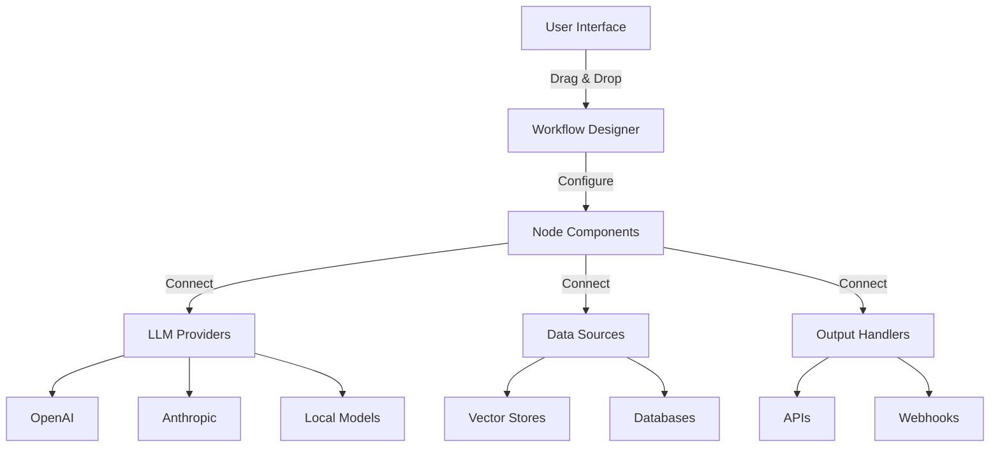

# FlowiseAI Service

FlowiseAI is a powerful visual workflow builder that enables developers to create LLM-based applications through an intuitive drag-and-drop interface. It supports integration with multiple AI services and provides a low-code solution for complex AI workflows.

## Architecture Overview



## Key Features

### Visual Workflow Builder
- Drag-and-drop interface for creating complex AI workflows
- Pre-built components for common AI tasks
- Real-time flow execution and debugging
- Visual data flow representation

### LLM Integrations
- Support for multiple LLM providers (OpenAI, Anthropic, Cohere, etc.)
- Local model integration via Ollama
- Custom model endpoint configuration
- Chain multiple models in sequence

### Data Connectors
- Vector database integration (Pinecone, Weaviate, etc.)
- Document loaders (PDF, Word, web scraping)
- Database connectors (PostgreSQL, MongoDB)
- API integration capabilities

### Advanced Capabilities
- Memory management for conversational flows
- Custom function nodes with JavaScript/Python
- Conditional logic and branching
- Error handling and retry mechanisms

## Configuration Schema

### Environment Variables
```bash
# Basic Configuration
PORT=3000
DATABASE_TYPE=postgres
DATABASE_HOST=postgres
DATABASE_USER=postgres
DATABASE_PASSWORD=postgres
DATABASE_NAME=flowise

# Authentication
JWT_AUTH_TOKEN_SECRET=your-jwt-secret
FLOWISE_USERNAME=admin
FLOWISE_PASSWORD=admin123

# Storage Paths
SECRETKEY_PATH=/root/.flowise
LOG_PATH=/root/.flowise/logs
BLOB_STORAGE_PATH=/root/.flowise/storage
```

### Node Configuration Example
```json
{
  "id": "openai-node",
  "type": "LLMChain",
  "data": {
    "model": "gpt-3.5-turbo",
    "temperature": 0.7,
    "maxTokens": 1000,
    "prompt": "Answer the following question: {question}"
  },
  "inputs": ["question"],
  "outputs": ["response"]
}
```

## Default Credentials

- **Username:** admin
- **Password:** admin123

!!! warning "Security"
    Change default credentials in production environments.

## Access

FlowiseAI is accessible at:

```
http://localhost:3001/
```

## Supported Integrations

### LLM Providers
- OpenAI (GPT-3.5, GPT-4)
- Anthropic (Claude)
- Cohere
- Hugging Face
- Azure OpenAI
- Local models via Ollama

### Vector Databases
- Pinecone
- Weaviate
- Qdrant
- Chroma
- Supabase

### Document Loaders
- PDF files
- CSV/Excel files
- Web scraping
- Notion pages
- GitHub repositories

## Online Resources

- **GitHub Repository:** [FlowiseAI GitHub](https://github.com/FlowiseAI/Flowise)
- **Official Website:** [FlowiseAI.com](https://flowiseai.com)
- **Documentation:** [FlowiseAI Docs](https://docs.flowiseai.com)
- **Community:** [Discord Server](https://discord.gg/jbaHfsRVBW)

## Use Cases

- **Chatbots:** Build intelligent conversational agents
- **Document Q&A:** Create systems for querying large document collections
- **Content Generation:** Automate content creation workflows
- **Data Analysis:** Build AI-powered analytics pipelines
- **API Integration:** Connect multiple services with AI processing

FlowiseAI is perfect for developers, product managers, and AI enthusiasts who want to rapidly prototype and deploy AI applications without extensive coding.
