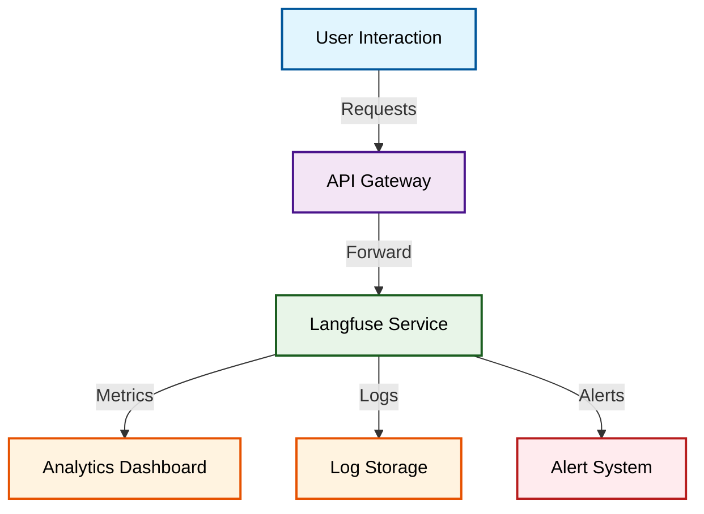

# Langfuse Service

Langfuse provides comprehensive observability for large language models (LLMs). It enables you to track usage, analyze performance metrics, and debug workflow issues within AI-driven applications.

## Architecture Diagram



## Features

- Real-time LLM usage tracking
- Comprehensive performance analysis
- AI workflow debugging
- Query and event logging
- Custom alerts and notifications

## Access

The Langfuse dashboard is accessible at:

```
http://localhost:3000/
```

## Online Resources

- **GitHub Repository:** [Langfuse GitHub](https://github.com/langfuse/langfuse)
- **Web Documentation:** [Langfuse Docs](https://docs.langfuse.io)

Langfuse is ideal for teams needing detailed insights into LLM usage patterns and operational metrics.
