# Ollama Service Documentation

## Overview
Ollama is a lightweight, extensible framework for building and running large language models (LLMs) locally. It provides a simple API for creating, running, and managing models on your machine, making it easy to integrate local AI capabilities into your applications without relying on cloud services.

## Key Features
- **Local Model Execution**: Run LLMs entirely on your local machine without internet connectivity
- **Model Management**: Easy downloading, updating, and organization of various LLM models
- **REST API**: Simple HTTP API compatible with OpenAI's chat completions format
- **Multi-format Support**: Supports GGUF, GGML, and other quantized model formats
- **Hardware Optimization**: Automatic GPU acceleration when available (CUDA, Metal, ROCm)
- **Model Customization**: Create custom models with Modelfiles
- **Concurrent Sessions**: Handle multiple model inference requests simultaneously
- **Memory Management**: Efficient model loading and unloading based on usage

## Architecture

```mermaid
graph TB
    %% Client Layer
    subgraph clients ["Client Applications"]
        py["🐍 Python SDK"]
        js["🟨 JavaScript SDK"]
        go["🔵 Go SDK"]
        curl["🌐 HTTP/REST"]
    end
    
    %% API Layer
    subgraph api ["Ollama Server"]
        gateway["🚪 API Gateway<br/>(OpenAI Compatible)"]
        
        subgraph management ["Model Management"]
            loader["📦 Model Loader"]
            memory["🧠 Memory Manager"]
            sessions["🔄 Session Handler"]
        end
        
        subgraph inference ["Inference Engine"]
            llama["⚡ llama.cpp"]
            gpu["🎮 GPU Acceleration"]
            quant["📊 Quantization"]
        end
    end
    
    %% Storage Layer
    subgraph storage ["Local Storage"]
        models["📁 Downloaded Models<br/>(~/.ollama)"]
        blobs["🗃️ Model Blobs"]
        manifests["📋 Manifests"]
        modelfiles["📝 Custom Modelfiles"]
    end
    
    %% Hardware Layer
    subgraph hardware ["Hardware Resources"]
        cpu["💻 CPU"]
        ram["🔲 RAM"]
        vram["🎯 GPU VRAM"]
        disk["💾 Disk Storage"]
    end
    
    %% Connections
    clients --> gateway
    gateway --> management
    gateway --> inference
    management --> loader
    management --> memory
    management --> sessions
    inference --> llama
    inference --> gpu
    inference --> quant
    loader --> storage
    memory --> hardware
    gpu --> vram
    llama --> cpu
    llama --> ram
    storage --> disk
    
    %% Styling
    classDef clientStyle fill:#e1f5fe,stroke:#01579b,stroke-width:2px,color:#000
    classDef serverStyle fill:#f3e5f5,stroke:#4a148c,stroke-width:2px,color:#000
    classDef storageStyle fill:#e8f5e8,stroke:#1b5e20,stroke-width:2px,color:#000
    classDef hardwareStyle fill:#fff3e0,stroke:#e65100,stroke-width:2px,color:#000
    classDef componentStyle fill:#fff8e1,stroke:#f57f17,stroke-width:1px,color:#000
    
    class clients,py,js,go,curl clientStyle
    class api,gateway serverStyle
    class management,inference,loader,memory,sessions,llama,gpu,quant componentStyle
    class storage,models,blobs,manifests,modelfiles storageStyle
    class hardware,cpu,ram,vram,disk hardwareStyle
```



## Configuration

### Environment Variables
```bash
# Server Configuration
OLLAMA_HOST=0.0.0.0:11434           # Server bind address
OLLAMA_ORIGINS=*                     # CORS allowed origins
OLLAMA_MODELS=~/.ollama/models       # Model storage directory
OLLAMA_KEEP_ALIVE=5m                 # Model keep-alive duration

# Hardware Configuration
OLLAMA_NUM_PARALLEL=4                # Number of parallel requests
OLLAMA_MAX_LOADED_MODELS=3           # Maximum models in memory
OLLAMA_FLASH_ATTENTION=1             # Enable flash attention
OLLAMA_LLM_LIBRARY=cpu               # Force CPU inference

# GPU Configuration
CUDA_VISIBLE_DEVICES=0,1             # CUDA GPU selection
OLLAMA_GPU_OVERHEAD=0                # GPU memory overhead (bytes)

# Privacy and Security
OLLAMA_TELEMETRY=false               # Disable telemetry
OLLAMA_DEBUG=false                   # Enable debug logging
```

### Docker Configuration
```yaml
version: '3.8'
services:
  ollama:
    image: ollama/ollama:latest
    container_name: ollama
    ports:
      - "${OLLAMA_PORT:-11434}:11434"
    volumes:
      - ollama_models:/root/.ollama
      - /dev/nvidia.com:/dev/nvidia.com  # GPU access
    environment:
      - OLLAMA_HOST=0.0.0.0:11434
      - OLLAMA_TELEMETRY=false
      - OLLAMA_KEEP_ALIVE=${OLLAMA_KEEP_ALIVE:-5m}
      - OLLAMA_NUM_PARALLEL=${OLLAMA_NUM_PARALLEL:-4}
    deploy:
      resources:
        reservations:
          devices:
            - driver: nvidia
              count: all
              capabilities: [gpu]
    restart: unless-stopped
    healthcheck:
      test: ["CMD", "curl", "-f", "http://localhost:11434/api/tags"]
      interval: 30s
      timeout: 10s
      retries: 3

volumes:
  ollama_models:
```

## Available Models

### Popular Models
| Model | Size | Description | Use Case |
|-------|------|-------------|----------|
| llama3.2:3b | ~2GB | Fast, efficient model | Quick responses, coding |
| llama3.2:8b | ~4.7GB | Balanced performance | General purpose |
| llama3.1:70b | ~40GB | High-quality responses | Complex reasoning |
| codellama:7b | ~3.8GB | Code-specialized | Programming tasks |
| mistral:7b | ~4.1GB | Fast, multilingual | General chat |
| phi3:3.8b | ~2.3GB | Microsoft's efficient model | Resource-constrained |
| gemma2:9b | ~5.5GB | Google's Gemma | Balanced performance |

### Specialized Models
- **embedding**: Text embeddings for semantic search
- **nomic-embed-text**: High-quality text embeddings
- **mxbai-embed-large**: Large context embeddings

## Usage Examples

### Basic Chat Completion
```python
import requests
import os

def chat_with_ollama(message, model="llama3.2:3b"):
    url = f"{os.getenv('OLLAMA_HOST', 'http://localhost:11434')}/api/chat"
    
    payload = {
        "model": model,
        "messages": [
            {"role": "user", "content": message}
        ],
        "stream": False
    }
    
    response = requests.post(url, json=payload)
    return response.json()["message"]["content"]

# Example usage
response = chat_with_ollama("Explain quantum computing")
print(response)
```

### Streaming Response
```python
import requests
import json

def stream_chat(message, model="llama3.2:3b"):
    url = f"{os.getenv('OLLAMA_HOST', 'http://localhost:11434')}/api/chat"
    
    payload = {
        "model": model,
        "messages": [{"role": "user", "content": message}],
        "stream": True
    }
    
    with requests.post(url, json=payload, stream=True) as response:
        for line in response.iter_lines():
            if line:
                chunk = json.loads(line.decode('utf-8'))
                if not chunk.get('done'):
                    print(chunk['message']['content'], end='', flush=True)
```

### OpenAI-Compatible API
```python
from openai import OpenAI

# Point to local Ollama server
client = OpenAI(
    base_url=f"{os.getenv('OLLAMA_HOST', 'http://localhost:11434')}/v1",
    api_key="ollama"  # Required but ignored
)

response = client.chat.completions.create(
    model="llama3.2:3b",
    messages=[
        {"role": "user", "content": "Write a Python function to calculate fibonacci"}
    ]
)

print(response.choices[0].message.content)
```

### Model Management
```bash
# Pull a model
curl -X POST http://localhost:11434/api/pull \
  -d '{"name": "llama3.2:3b"}'

# List installed models
curl http://localhost:11434/api/tags

# Delete a model
curl -X DELETE http://localhost:11434/api/delete \
  -d '{"name": "llama3.2:3b"}'
```

## CLI Commands

### Basic Operations
```bash
# Start Ollama server
ollama serve

# Pull and run a model
ollama run llama3.2:3b

# List available models
ollama list

# Show model information
ollama show llama3.2:3b

# Pull a specific model
ollama pull mistral:7b

# Remove a model
ollama rm llama3.2:3b

# Copy a model
ollama cp llama3.2:3b my-model
```

### Creating Custom Models
```bash
# Create a Modelfile
cat > Modelfile << 'EOF'
FROM llama3.2:3b
SYSTEM "You are a helpful coding assistant specialized in Python."
PARAMETER temperature 0.7
PARAMETER top_p 0.9
EOF

# Build custom model
ollama create coding-assistant -f Modelfile

# Use custom model
ollama run coding-assistant "Write a sorting algorithm"
```

## API Endpoints

### Core Endpoints
- `POST /api/generate` - Generate text completion
- `POST /api/chat` - Chat with model
- `POST /api/pull` - Download a model
- `POST /api/push` - Upload a model
- `GET /api/tags` - List local models
- `POST /api/delete` - Delete a model
- `POST /api/copy` - Copy a model
- `POST /api/show` - Show model information
- `POST /api/embeddings` - Generate embeddings

### OpenAI-Compatible Endpoints
- `GET /v1/models` - List available models
- `POST /v1/chat/completions` - Chat completions
- `POST /v1/completions` - Text completions
- `POST /v1/embeddings` - Generate embeddings

## Performance Optimization

### Hardware Requirements
- **Minimum**: 4GB RAM, 2GB disk space
- **Recommended**: 16GB+ RAM, GPU with 8GB+ VRAM
- **Optimal**: 32GB+ RAM, RTX 4090/A100 GPU

### Model Selection Guidelines
- **3B models**: Fast responses, basic reasoning
- **7B models**: Good balance of speed and quality
- **13B+ models**: Higher quality, slower responses
- **70B+ models**: Best quality, requires significant resources

### Memory Management
```bash
# Configure model keep-alive
export OLLAMA_KEEP_ALIVE=10m

# Limit concurrent models
export OLLAMA_MAX_LOADED_MODELS=2

# Control parallel requests
export OLLAMA_NUM_PARALLEL=2
```

## Troubleshooting

### Common Issues
1. **Model Loading Errors**
   - Check available disk space
   - Verify model file integrity
   - Restart Ollama service

2. **GPU Not Detected**
   - Install appropriate GPU drivers
   - Set CUDA_VISIBLE_DEVICES
   - Check GPU memory availability

3. **Memory Issues**
   - Reduce OLLAMA_NUM_PARALLEL
   - Use smaller models
   - Increase system swap

4. **API Connection Issues**
   - Verify OLLAMA_HOST setting
   - Check firewall rules
   - Ensure service is running

### Debug Mode
```bash
# Enable debug logging
export OLLAMA_DEBUG=1
ollama serve

# Check service status
curl http://localhost:11434/api/tags
```

## Security Considerations

### Network Security
- Bind to localhost (127.0.0.1) for local-only access
- Use reverse proxy with authentication for remote access
- Configure CORS origins appropriately
- Monitor API access logs

### Model Security
- Verify model checksums after download
- Use trusted model sources
- Scan custom models for malicious content
- Implement rate limiting for public APIs

### Privacy Features
- All processing happens locally
- No data sent to external services
- Telemetry disabled by default
- Models stored locally in ~/.ollama

## Resources

### Official Links
- **Website**: https://ollama.com/
- **GitHub**: https://github.com/ollama/ollama
- **Model Library**: https://ollama.com/library
- **Documentation**: https://github.com/ollama/ollama/tree/main/docs

### Community Resources
- **Discord**: https://discord.gg/ollama
- **Reddit**: https://reddit.com/r/ollama
- **Model Hub**: https://huggingface.co/models?library=gguf

### Integration Examples
- **Python SDK**: https://github.com/ollama/ollama-python
- **JavaScript SDK**: https://github.com/ollama/ollama-js
- **Go SDK**: https://github.com/ollama/ollama/tree/main/api
- **REST API Examples**: https://github.com/ollama/ollama/blob/main/docs/api.md
