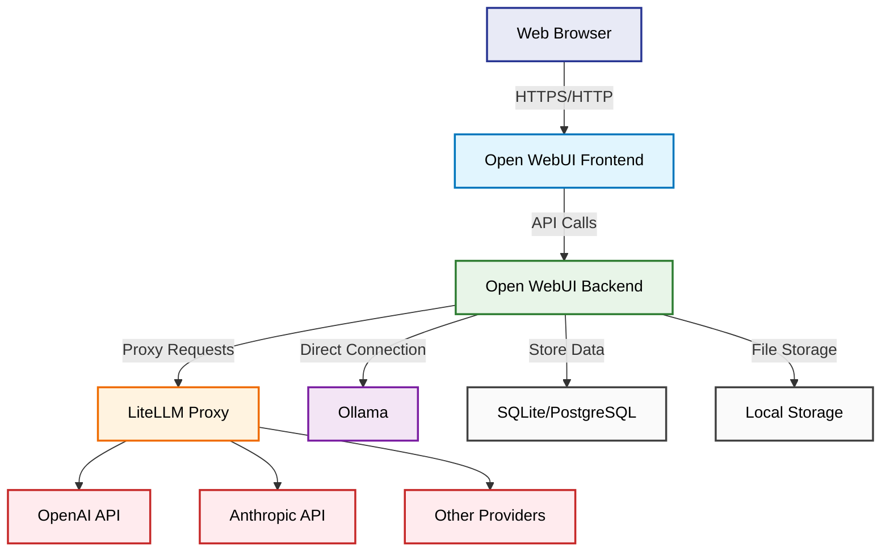

# Open WebUI Service

Open WebUI is a feature-rich, self-hosted web interface that provides a ChatGPT-like experience for interacting with various large language models. It offers an extensible platform supporting multiple LLM providers, local models, and advanced chat features.

## Architecture Overview



## Key Features

### Multi-Provider Support
- Seamless integration with multiple LLM providers
- Model switching without service restart
- Provider failover and load balancing
- Custom API endpoint configuration

### Advanced Chat Interface
- ChatGPT-like conversational experience
- Markdown rendering with syntax highlighting
- LaTeX math equation support
- Code execution capabilities
- Image generation integration

### File Management
- Document upload and processing
- PDF, DOCX, and text file support
- Image upload for vision models
- Conversation export (JSON, Markdown)

### User Management
- Multi-user support with authentication
- Role-based access control
- User registration and profile management
- API key management

### Customization Options
- Custom model parameters (temperature, max tokens)
- System prompts and templates
- Custom CSS and theming
- Plugin system for extensions

## Configuration Schema

### Environment Variables
```bash
# API Configuration
OLLAMA_BASE_URL=http://host.docker.internal:11434
OPENAI_API_BASE_URL=http://litellm:4000/v1
OPENAI_API_KEY=******************

# Security Configuration
WEBUI_SECRET_KEY=${WEBUI_SECRET_KEY}
WEBUI_JWT_SECRET_KEY=${WEBUI_JWT_SECRET_KEY}

# User Management
DEFAULT_USER_ROLE=admin
ENABLE_SIGNUP=true
ENABLE_LOGIN_FORM=true

# Model Configuration
DEFAULT_MODELS=gpt-3.5-turbo,gpt-4,claude-3-sonnet

# Interface Settings
WEBUI_NAME=AI Dev Local
```

### Model Configuration Example
```json
{
  "models": [
    {
      "id": "gpt-4",
      "name": "GPT-4",
      "provider": "openai",
      "parameters": {
        "temperature": 0.7,
        "max_tokens": 4096,
        "top_p": 1.0
      }
    },
    {
      "id": "claude-3-sonnet",
      "name": "Claude 3 Sonnet",
      "provider": "anthropic",
      "parameters": {
        "temperature": 0.5,
        "max_tokens": 2048
      }
    }
  ]
}
```

### User Profile Schema
```json
{
  "id": "user-123",
  "name": "John Doe",
  "email": "john@example.com",
  "role": "user",
  "preferences": {
    "theme": "dark",
    "language": "en",
    "default_model": "gpt-4",
    "show_timestamps": true
  },
  "api_keys": {
    "openai": "sk-...",
    "anthropic": "sk-ant-..."
  }
}
```

## Default Configuration

- **Default Role:** admin
- **Signup Enabled:** Yes
- **Login Form:** Enabled
- **Default Models:** gpt-3.5-turbo, gpt-4

## Access

Open WebUI is accessible at:

```
http://localhost:8081/
```

## Supported Features

### Model Providers
- **OpenAI:** GPT-3.5, GPT-4, GPT-4 Vision
- **Anthropic:** Claude 3 (Haiku, Sonnet, Opus)
- **Google:** Gemini Pro, Gemini Pro Vision
- **Local Models:** Via Ollama integration
- **Custom APIs:** Any OpenAI-compatible endpoint

### File Types
- **Documents:** PDF, DOCX, TXT, MD
- **Images:** PNG, JPG, GIF, WebP (for vision models)
- **Data:** CSV, JSON, XML
- **Code:** Various programming languages

### Export Formats
- **Conversations:** JSON, Markdown, PDF
- **Data:** CSV for analytics
- **Images:** Generated images and diagrams

## Advanced Features

### Function Calling
- Built-in web search capabilities
- Calculator and math functions
- Weather and news APIs
- Custom function definitions

### Memory System
- Conversation history storage
- Cross-session memory retention
- Searchable chat history
- Context-aware responses

### Plugin System
- Community-developed plugins
- Custom integration capabilities
- API extensions
- Third-party service connectors

## Online Resources

- **GitHub Repository:** [Open WebUI GitHub](https://github.com/open-webui/open-webui)
- **Official Website:** [OpenWebUI.com](https://openwebui.com)
- **Documentation:** [Open WebUI Docs](https://docs.openwebui.com)
- **Community:** [Discord Server](https://discord.gg/5rJgQTnV4s)
- **Docker Hub:** [Open WebUI Images](https://hub.docker.com/r/ghcr.io/open-webui/open-webui)

## Use Cases

- **Personal AI Assistant:** Private ChatGPT-like interface
- **Team Collaboration:** Shared AI workspace for teams
- **Development Tool:** Code generation and debugging assistant
- **Research Platform:** Academic and professional research aid
- **Customer Support:** AI-powered support interface
- **Content Creation:** Writing and creative assistance

## Security Features

- **Authentication:** JWT-based user authentication
- **Authorization:** Role-based access control
- **Data Privacy:** Local data storage options
- **API Security:** Secure API key management
- **CORS Protection:** Configurable CORS policies

Open WebUI is ideal for individuals and organizations seeking a powerful, self-hosted alternative to commercial AI chat interfaces, with full control over data and customization options.
